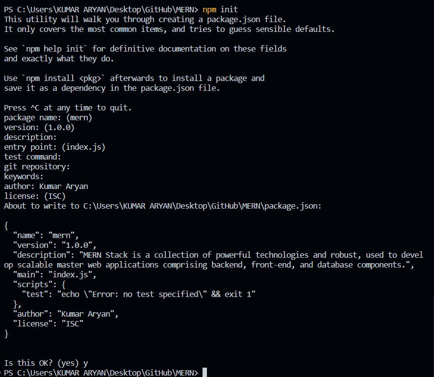
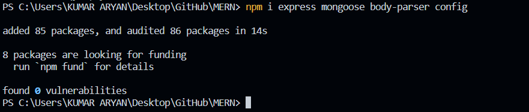
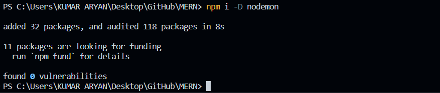
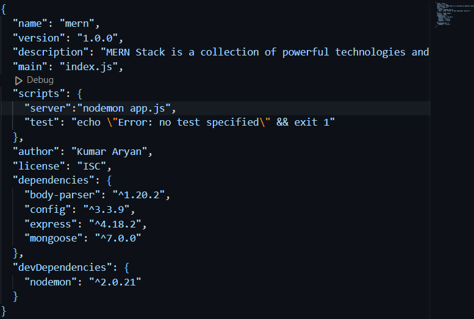
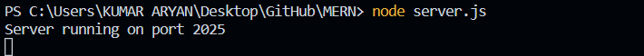
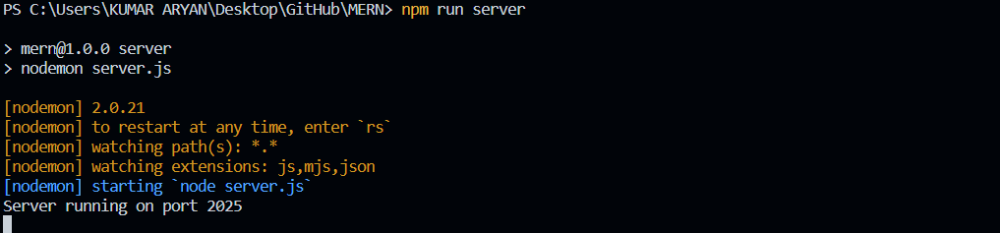
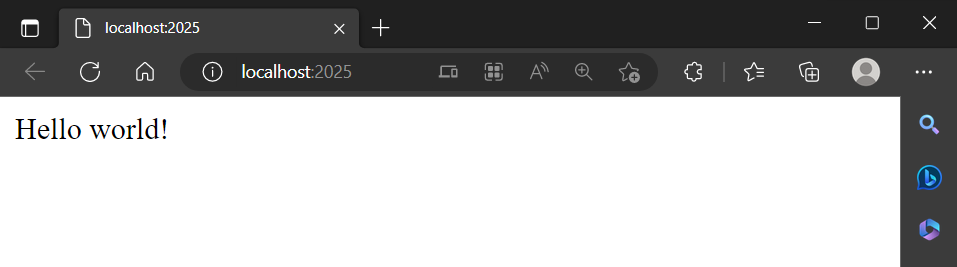
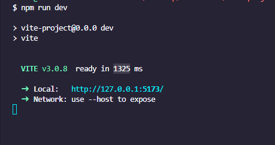
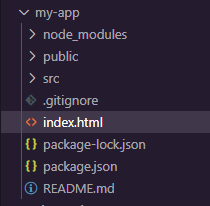

# 30 Days MERN Challenge


### <i style="color:teal">Set Up a development environment with Node.js, MongoDB and React</i>

Install Node.js: 
- Download and install Node.js from the official website: https://nodejs.org/en/download

Verify Node.js installation: 
- Open a terminal and run the following commands to verify that Node.js and npm (Node Package Manager, which comes with Node.js) are installed correctly:

```cmd
    node -v
    npm -v
```

Install MongoDB: 
- Download and install MongoDB from the official website: https://www.mongodb.com/try/download/community

- [ MongoDB Community Server Download ]

_Be aware of Adding MongoDB to your PATH environment variable._

exmaple: 

<code>
C:\Program Files\MongoDB\Server\{version}\bin
</code>

<br>
Verify MongoDB installation:

- Open a terminal and run the following command to verify that MongoDB is installed correctly:

```cmd
    mongo --version
```

Start MongoDB: 
- Depending on your operating system, the command to start MongoDB may vary. On Unix systems, the command is typically:
```cmd
    mongod
```
The MongoDB driver is a library that provides a high-level API to interact with MongoDB databases from your application. It allows you to connect to a MongoDB database, perform CRUD operations (Create, Read, Update, Delete), listen to changes in the database, and more.

**_npm package initialization_**

Enter the folder through the terminal, then run 
```cmd
$ npm init
```
Then, it will ask you some questions about the package name, version, entry point, and more.



Select yes, and you’re ready to go. This will create a file named package.json in same folder.

### Installing the dependencies
We’ll add some dependencies with 
> $ npm i package1-name package2-name and so on



---

_Some Common Used Package Dependency_

- body-parser: 
    - This is a middleware that allows you to parse incoming request bodies in a middleware before your handlers. It's used to extract the entire body portion of an incoming request stream and exposes it on req.body. This is especially helpful when you're working with JSON data or URL-encoded data.

- express: 
    - Express is a minimal and flexible Node.js web application framework that provides a robust set of features for web and mobile applications. It simplifies the process of writing server code, and includes features for routing, middleware, sending responses, etc.

- mongoose: 
    - Mongoose is an Object Data Modeling (ODM) library for MongoDB and Node.js. It provides a straight-forward, schema-based solution to model your application data. It includes built-in type casting, validation, query building, business logic hooks and more, out of the box.

- config: 
    - The config package allows you to manage configuration files in your Node.js applications. It lets you define a set of default parameters, and extend them for different deployment environments (development, QA, production, etc.). This makes your application easy to configure and deploy.

- cors: 
    - This is a Node.js package for providing a Connect/Express middleware that can be used to enable Cross Origin Resource Sharing (CORS). With CORS, web applications running at one domain can request resources from another domain.

- dotenv: 
    - Dotenv is a zero-dependency module that loads environment variables from a .env file into process.env. Storing configuration in the environment separate from code is based on The Twelve-Factor App methodology.

- nodemon: 
    - Nodemon is a utility that will monitor for any changes in your source and automatically restart your server. It's used in development only.

- morgan: 
    - HTTP request logger middleware for Node.js. It simplifies the process of logging requests to your application.

- jsonwebtoken: 
    - This is a library that helps you work with JSON Web Tokens (JWT). JWTs are a good way to securely transmit information between parties, and can be used for authorization.

- bcryptjs: 
    - A library to help you hash passwords. It's useful for storing passwords securely in your database.

- express-validator: 
    - A set of express.js middlewares that wraps validator.js validator and sanitizer functions. This helps you validate and sanitize input data.

- helmet: 
    - Helmet helps you secure your Express apps by setting various HTTP headers. It's not a silver bullet, but it can help!

- winston: 
    - A logger for just about everything. Winston is designed to be a simple and universal logging library with support for multiple transports.

- passport: 
    - Passport is Express-compatible authentication middleware for Node.js. It's flexible and modular and can be plugged into any Express-based web application. It provides a comprehensive set of strategies support authentication using a username and password, Facebook, Twitter, and more.

---
_Development Dependencies_

Development dependencies, also known as devDependencies, 
- are the modules 
- which are only needed during development. 
- These are typically 
    - testing frameworks, 
    - build tools, 
    - compilers, 
    - linters, or 
    - transpilers.

In a Node.js project, 
- these dependencies are listed in the devDependencies section of the package.json file. 
- They can be installed using npm with the --save-dev (or -D for short) option:

```cmd
    npm install --save-dev <package-name>
```

When you install modules with npm, 
- you can use the --production flag to avoid installing these development dependencies:

```cmd
    npm install --production
```

This is useful when you're deploying your application, as it reduces the size and installation time of your application by not installing unnecessary packages.

---
_Some Common Used Package Development Dependency_

- eslint: 
    - A pluggable and configurable linter tool for identifying and reporting on patterns in JavaScript.

- mocha: 
    - A feature-rich JavaScript test framework running on Node.js and in the browser, making asynchronous testing simple and fun.

- chai: 
    - A BDD / TDD assertion library for Node.js that can be delightfully paired with any javascript testing framework.

- sinon: 
    - Standalone test spies, stubs and mocks for JavaScript. Works with any unit testing framework.

- nodemon: 
    - A utility that will monitor for any changes in your source and automatically restart your server. Perfect for development.

- babel: 
    - A JavaScript compiler that includes the capability to compile ES2015 and beyond into ES5 compatible code.

- webpack: 
    - A static module bundler for modern JavaScript applications.

- prettier: 
    - An opinionated code formatter that supports multiple languages and integrates with most editors.

- husky: 
    - Git hooks made easy. Husky can prevent bad git commit, git push and more.

- jest: 
    - A delightful JavaScript Testing Framework with a focus on simplicity.

---
Example :


Install nodemon as Development Dependency
>$ npm i -D nodemon. 

To use nodemon, add 
```json
{"server": "nodemon server.js"}
``` 
to your scripts tag under the ' package.json ' file.

Nodemon is 
- a utility that will monitor for any changes in your source and automatically restart your server.



After that, your package.json should look like this:



---

**MongoDB Driver**

- The MongoDB driver is a library that provides a high-level API to interact with MongoDB databases from your application. 
- It allows you to connect to a MongoDB database, perform CRUD operations (Create, Read, Update, Delete), listen to changes in the database, and more.

- The MongoDB driver is needed because 
    - MongoDB uses a binary protocol over TCP/IP to communicate with applications, which is not easy to use directly. 
    - The driver takes care of encoding and decoding this protocol, and provides a simple, idiomatic API that is specific to your programming language.

_Install As_

- In Node.js, the MongoDB driver is installed as a package from the npm registry. It's installed in your project's node_modules directory, and its dependencies are listed in your project's package.json file.

Install a MongoDB driver: 
- In your Node.js project, you'll need a MongoDB driver to interact with the database. The official driver is mongodb. Install it with npm:

```cmd
    npm install mongodb
```

After running this command, you can require the mongodb package in your JavaScript files to use the MongoDB driver:

```cmd
    const mongodb = require('mongodb');
```

This will give you access to the MongoClient object, which you can use to connect to a MongoDB database and perform operations on it.

1. <i style="color:yellow">Create a basic Express server in Node.js</i>

- Create a new directory for your project:

```cmd
    mkdir myproject
    cd myproject
```
  
- Initialize a new Node.js project:
```cmd
    npm init -y
```
- Install Express:

```cmd
    npm install express
```
- Create a new file ' server.js ' and set up a basic Express server:

```js
    const express = require('express');
    const app = express();
    const port = 2025;

    app.get('/', (req, res) => {
        res.send('Hello World!');
    });

    app.listen(port, () => {
        console.log(`Server running at http://localhost:${port}`);
    });
```

- Run the Express server:
```cmd
    node server.js
```

- Now, you have a basic Express server running at http://localhost:2025


    

<br>

- At this point, if we change anything, we’ll need to restart the server manually. 

- But, if we set up nodemon, then we don’t have to restart it every time. 

- Nodemon will watch if there is any change and restart the server automatically.

- you can run your project using the 
- >$ npm run server

    

You will see Server running on port 2025. You can also check it from the browser by opening the browser and entering http://localhost:2025.



---

### <a href="https://blog.logrocket.com/vite-3-vs-create-react-app-comparison-migration-guide/" target="_blank"> _Vite 3.0 vs. Create React App: Comparison and migration guide_</a>

_JavaScript Module System have evolved as follow_ :

- Global Functions (1995): 
    - When JavaScript was first introduced, all code was written in global functions. 
    - This quickly led to naming conflicts and difficulty in managing code as applications grew larger.

```js
    define(['module'], function(module) {
     // Use module
    });
```

- Immediately-Invoked Function Expressions (IIFEs) (around 2000): 
    - To avoid global scope pollution, developers started wrapping their code in IIFEs. 
    - This provided a way to create a new scope and isolate variables.

```js
    (function() {
    var privateVariable = 'I am private';
    // Other code here...
    })();
```

- Module Pattern (around 2003): 
    - This is an evolution of IIFEs where a module is an IIFE that returns an object. 
    - The returned object contains all the functions and variables that should be accessible from outside the module.
```js
    var myModule = (function() {
    var privateVariable = 'I am private';
    var publicVariable = 'I am public';

    function privateFunction() {
        // ...
    }

    function publicFunction() {
        // ...
    }

    return {
        publicVariable: publicVariable,
        publicFunction: publicFunction
    };
    })();
```
- Asynchronous Module Definition (AMD) (2009): 
    - This was primarily used in the browser and allows for asynchronous loading of modules.

```js
    define(['module'], function(module) {
    // Use module
});
```

- CommonJS (CJS) (2009): 
    - This is the module system used in Node.js. It allows for synchronous loading of modules, which is fine for server-side code but not ideal for the browser.
```js
    var module = require('module');
```

- Universal Module Definition (UMD) (2011):
    - This is a pattern that allows a module to work in both the browser and Node.js.

```js
    (function (root, factory) {
        if (typeof define === 'function' && define.amd) {
            // AMD. Register as an anonymous module.
            define(['b'], factory);
        } else if (typeof module === 'object' && module.exports) {
            // Node. Does not work with strict CommonJS, but
            // only CommonJS-like environments that support module.exports,
            // like Node.
            module.exports = factory(require('b'));
        } else {
            // Browser globals (root is window)
            root.returnExports = factory(root.b);
        }
        }(typeof self !== 'undefined' ? self : this, function (b) {
            // Use b in some fashion.

            // Just return a value to define the module export.
            // This example returns an object, but the module
            // can return a function as the exported value.
            return {};
    }));
```
- ES Modules (2015): 
    - Introduced in ES6 (ECMAScript 2015), ES Modules allow you to easily split your JavaScript code into separate files (modules) which can import from and export to each other.

```js
    // utils.js
    export function add(a, b) {
    return a + b;
    }

    // main.js
    import { add } from './utils.js';

    console.log(add(2, 3));  // Outputs: 5
```

- Dynamic Imports (2020): 
    - Introduced in ES2020, dynamic imports allow you to load JavaScript modules dynamically, as a function. This means you can conditionally load modules only when they are needed, or load modules on demand, instead of loading all scripts at the start.

```js
    // utils.js
    export function add(a, b) {
    return a + b;
    }

    // main.js
    if (someCondition) {
    import('./utils.js')
        .then(module => {
        console.log(module.add(2, 3));  // Outputs: 5
        })
        .catch(err => {
        // Handle error
        });
    }
```

2. <i style="color:yellow">Create a basic React application in Node.js</i>

**_Setting up a React project with Create-React-App_**

- Create a new React application: First, you need to install create-react-app if you haven't already:

 ```cmd
    npx create-react-app client
```
- Start the React application:
Now, a React application running at http://localhost:3000.

_Please note that in a real-world application, you would probably want to serve the React application from the Express server and use a proxy to avoid CORS issues. This is a simplified example for demonstration purposes._

 **_Setting up a React project with Vite_**

- To create a Vite app, go to your machine’s terminal, cd to a preferred folder, and run the following command:
```cmd
    npm create vite@latest
```
- After running the command, the CLI will prompt you to choose a project name. 
- In our case, we’ll use the default name vite-project. 
- Then, we’ll select react from the list of available templates. 
- This usually takes 10s or less:
- Select React Framework Vite 3
<br>


_Alternatively, you can specify your template of choice in the command and avoid going through the prompt_.

- You can do so by adding a --template flag, followed by the framework’s name:
```cmd
npm init vite@latest vite-project --template react
```
- Next, cd into the project folder, install the necessary dependencies, and start the dev server with the following commands:
```cmd
cd vite-project
npm install
npm run dev
```
After these commands run, a development server will be up and running on port 5173. It usually takes Vite just 1325ms to serve an application:



Vite Time Serve Application

Now, open your browser and enter localhost:5173. 

You’ll see a page similar to the one below with the quintessential count button:

We’ve successfully set up a Vite React development environment! Next, we’ll look at how to migrate a Create React App project to Vite.

---

<b style="color:teal">_Migrating a Create React App project to Vite_</b>

If you have an existing CRA project, it’s pretty simple to migrate it to Vite. First, open the package.json file in your project folder and delete react-scripts from the list of dependencies:

```json
  "dependencies": {
    ...
    "react-scripts": "5.0.1",
    ...
  },  
```
Next, add "devDependencies" with the following code:
```json
  "devDependencies": {
    "@vitejs/plugin-react": "^2.0.1",
    "vite": "^3.0.7"
  }, 
```
Now, replace the scripts below with the following code snippet, respectively:
```json
  "scripts": {
    "start": "react-scripts start",
    "build": "react-scripts build",
    "test": "react-scripts test",
    "eject": "react-scripts eject"
  },
  "scripts": {
    "start": "vite",
    "build": "vite build",
  },
```
Go to the index.html file inside the Public folder and remove every %PUBLIC_URL%/ prefix in the link paths:
```html
    <link rel="icon" href="%PUBLIC_URL%/favicon.ico" />

    <link rel="apple-touch-icon" href="%PUBLIC_URL%/logo192.png" />

    <link rel="manifest" href="%PUBLIC_URL%/manifest.json" />
```
Replace the removed prefix with the following:

```html
<link rel="icon" href="./public/favicon.ico" />
 ...
<link rel="apple-touch-icon" href="./public/logo192.png" />
 ...
<link rel="manifest" href="./public/manifest.json" />
```
Then, add an entry point script inside the body element, just below the root div:

```html
<script type="module" src="/src/index.jsx"></script>
```
_Before you do this, rename every .js file that contains React codes to a .jsx file. For example, you’d rename the index.js file to index.jsx._

Then, move the index.html file to the root folder:



- _Next, we’ll create a Vite config file, delete the node modules folder, and reinstall the dependencies._ 

- _Start by creating a ' vite.config.js ' file inside the root folder and add the following code:_

```js
import { defineConfig } from "vite";
import react from "@vitejs/plugin-react";

export default defineConfig({
  plugins: [react()],
})
```
_Next, go to the root folder and delete the node_modules folder._

- Then, run the following command to reinstall the dependencies and start the development server:

```cmd
npm install
npm start
```
Now, if you open your browser and go to localhost:5173, the development server should successfully boot up:

---

<i style="color:rgb(115,180,120)">_Differences between Create React App and Vite_</i>

- _Absolute imports_

    - When you start developing with Vite, the first thing you’ll probably notice is the difference in path resolving.
    
    - Unlike CRA, Vite doesn’t have an inbuilt src path. So, instead of importing files and components in your React app with the following code:
    ```js
    import Cards from "components/cards";
    ```
    - You’ll need to import them as follows:


_Fortunately, there’s a fix for this path resolving._

Go to the project’s root folder, open the vite.config.js file, and replace the existing code with the following respective code blocks:

```js
import { defineConfig } from "vite";
import react from "@vitejs/plugin-react";

export default defineConfig({
  plugins: [react()],
});
import { defineConfig } from "vite";
import react from "@vitejs/plugin-react";

export default defineConfig({
  resolve: {
    alias: [
      {
        find: "common",
        replacement: resolve(__dirname, "src/common"),
      },
    ],
  },

  plugins: [react()],
});
```

Save the code, and you should now be able to use absolute paths in your project.


- _Environment variables_

    - Another difference between Create React App and Vite is the environment variable naming convention. 
    - If you’re using environment variables in your project, you’ll want to replace the REACT_APP_ prefix with VITE_:

```js
    //Instead of this 
    REACT_APP_ API_KEY = 1234567890..
    //Use this
    VITE_API_KEY = 1234567890..
```
Changing the variables one by one can be a pain, especially if you have a lot of variables present in the .env file.

_Fortunately, the vite-plugin-env-compatible package lets us use environment variables without changing their names._

**_Use the following command to install the vite-plugin-env-compatible package:_**

```cmd
npm i vite-plugin-env-compatible
```

Next, go to the vite.config.js file in the root folder of the project and add the following code:

```js
import envCompatible from 'vite-plugin-env-compatible';

export default defineConfig({
    ...
  envPrefix: 'REACT_APP_',

  plugins: [
    react(),
    envCompatible
  ],
});
```

The envPrefix property will tell Vite to use variables with a REACT_APP_ prefix. 

Now, you can use environment variables in your project without changing names.

_However, you’ll still have to replace process.env with import.meta.env in your code._

3. <i style="color:yellow">Connect the React Frontend to Express Backend</i>

_CORS_

- CORS stands for Cross-Origin Resource Sharing. 
- It is a mechanism that uses additional HTTP headers 
    - to tell browsers to give a web application running at one origin, access to selected resources from a different origin.

_For security reasons, web browsers prohibit web pages from making requests to a different domain than the one the web page came from. This is known as the " same-origin policy "._

- CORS is a W3C standard that allows a server to relax the same-origin policy.

- Using CORS, a server can explicitly allow some cross-origin requests while rejecting others.

_For example, if you have a web application running on http://localhost:3000 (origin A) and it tries to make a request to an API running on http://localhost:5000 (origin B), the browser's same-origin policy will block the request. To allow the request, the server at origin B can include the appropriate CORS headers to tell the browser that it's okay to allow requests from origin A._

_In Node.js applications, the cors middleware can be used to set these headers for you._

- Install cors in your server directory:

```cmd
    npm install cors
```

Then, use it in your server.js file:

```js
    // server.js
    // const express = require('express');
    const cors = require('cors');
    // const app = express();
    // const port = 5000;

    app.use(cors());

    // app.get('/api', (req, res) => {
    // res.json({ message: 'Hello from server!' });
    // });

    // app.listen(port, () => {
    // console.log(`Server is running on http://localhost:${port}`);
    // });
```


- **Set up a proxy:** 
- In your React application's ' package.json ' file, add a proxy field pointing to the Express server's address. 
    - This will forward requests from the React app to the Express server, avoiding CORS issues.
```json
    "proxy": "http://localhost:3000"
```
- **Make a request from the React app to the Express server:** 
- In your React application, you can " use the fetch function to make a request to the Express server ". 
- _Since you set up a proxy, you can use relative URLs_.

```js
    fetch('/api')
    .then(response => response.json())
    .then(data => console.log(data));
```
_fetch returns a promise that resolves to the Response object representing the response to the request._

_The response.json() method also returns a promise that resolves with the result of parsing the body text as JSON._

- **Handle the request in the Express server:** 
- In your Express server, you need to handle the /api route and send a response. Here's a simple example:

```js
    app.get('/api', (req, res) => {
    res.json({ message: 'Hello from server!' });
});
```
- **Install and use CORS in Express server:** 
- Although the proxy helps in development, in production, you might need to handle CORS issues. Install and use the cors middleware in your Express server.

```cmd
    npm install cors
```
Then, in your server.js file:

```js
    const cors = require('cors');
    app.use(cors());
```

_Run both servers: You can now run both the Express server and the React application. They will communicate with each other through the proxy you set up._

```cmd
    # In the Express server directory
    node server.js

    # In the React application directory
    npm start
```
_Now, when you load your React application, it will make a request to the Express server and log the response to the console._


4. <i style="color:yellow">Connect the Express Backend to  MongoDB Database</i>


Start MongoDB: 
- Depending on your operating system, the command to start MongoDB may vary. On Unix systems, the command is typically:
```cmd
    mongod
```

Install a MongoDB driver: 
- In your Node.js project, you'll need a MongoDB driver to interact with the database. The official driver is mongodb. Install it with npm:

```cmd
    npm install mongodb
```

Connect to MongoDB: 
- In your Node.js code, you can now connect to MongoDB using the mongodb package. Here's a basic example:

```js
    const MongoClient = require('mongodb').MongoClient;
    const url = 'mongodb://localhost:27017/mydb';

    MongoClient.connect(url, function(err, db) {
        if (err) throw err;
        console.log("Database created!");
        db.close();
});
```
_This will connect to MongoDB running on localhost, create a new database called mydb, and then close the connection._

_Now, you have a development environment set up with Node.js and MongoDB. You can start building your application!_

Connect to MongoDB Atlas: 

- If you want to use MongoDB Atlas, you can follow the instructions below.

- Create an account <a href="https://www.mongodb.com/atlas/database"> here</a>. After creating an account, you will see something like this:


- Click the <b>Project 0</b> section (top left),
- you will see a button for Creating a New Project. 
- Create a project and select the project. 
- Now, click the <b>Build a Database</b> button from the project you have created. It will show you all the information.

- At the bottom, you will see a section called <b>Cluster Name</b>, click that and enter a name for the database, then hit the <b>Create Cluster</b> button. 
- After two to three minutes, if everything goes well, you will find something like this:


- Click the CONNECT button if you filled the username and password for your database at time of creation it will show you like this:


- Now, if you follow the CONNECT button or the Choose a connection method button, you will see some different methods. Select accordingly:


- In this case, select the Connect Your Application section.
- Now, you will get your database link, which we will use in our next step:


### Adding the database to our project

Our database is ready, and we need to add it to our project.
- Inside the project folder, create another folder named <b>config</b> and create two files named <b>default.json</b> and <b>db.js</b>.

Add the following code:

**default.json**
```json
{
  "mongoURI":
    "mongodb+srv://mern123:<password>@mernatoz-9kdpd.mongodb.net/test?retryWrites=true&w=majority"
}
 /* Replace <password> with your database password */
 ```
**db.js**

 ```js
 

const mongoose = require('mongoose');
const config = require('config');
const db = config.get('mongoURI');

const connectDB = async () => {
  try {
    mongoose.set('strictQuery', true);
    await mongoose.connect(db, {
      useNewUrlParser: true,
    });

    console.log('MongoDB is Connected...');
  } catch (err) {
    console.error(err.message);
    process.exit(1);
  }
};

module.exports = connectDB;
```

- We need a little change in our server.js file to connect to the database. Update your server.js by adding this:

```js
const connectDB = require('./config/db');

// Connect Database
connectDB();
</code>

Now, you can run the project using the 
>$ npm run server

You should see the following:


```