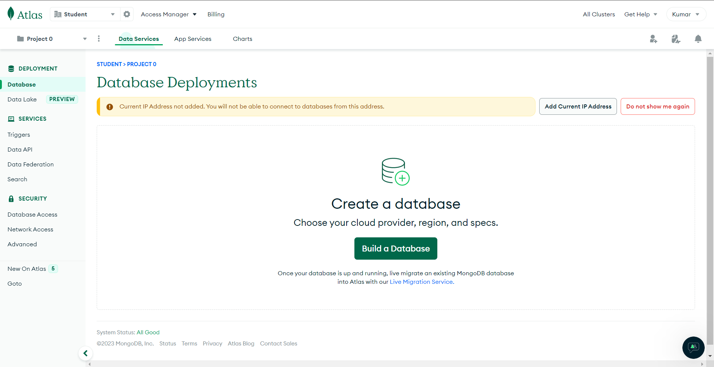
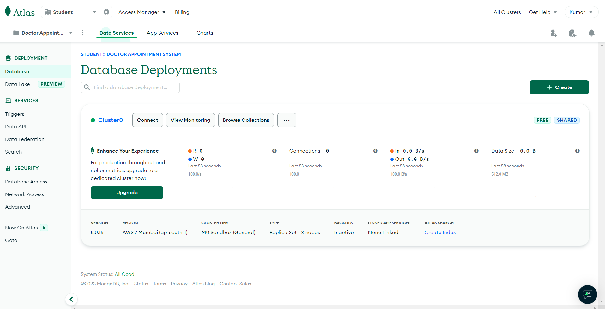
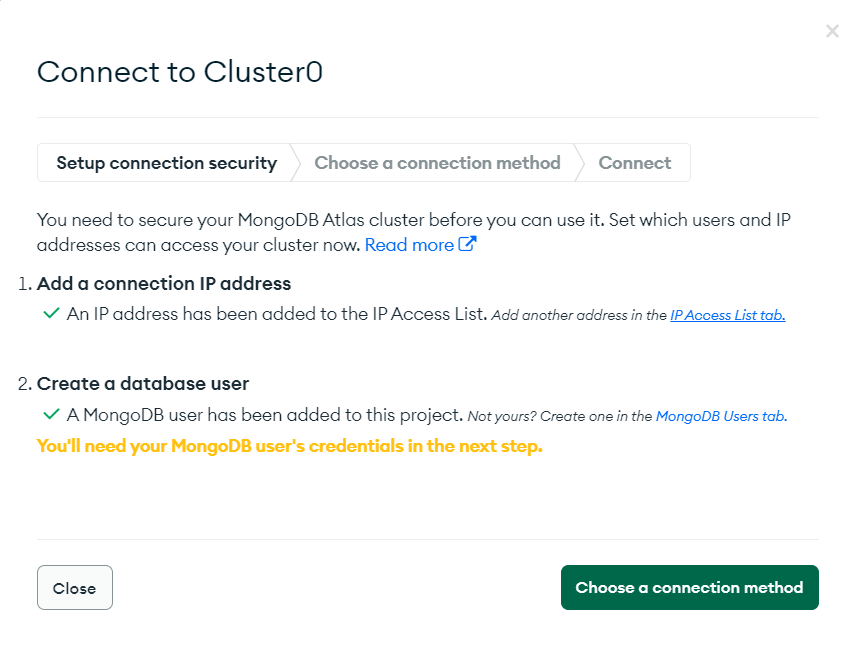
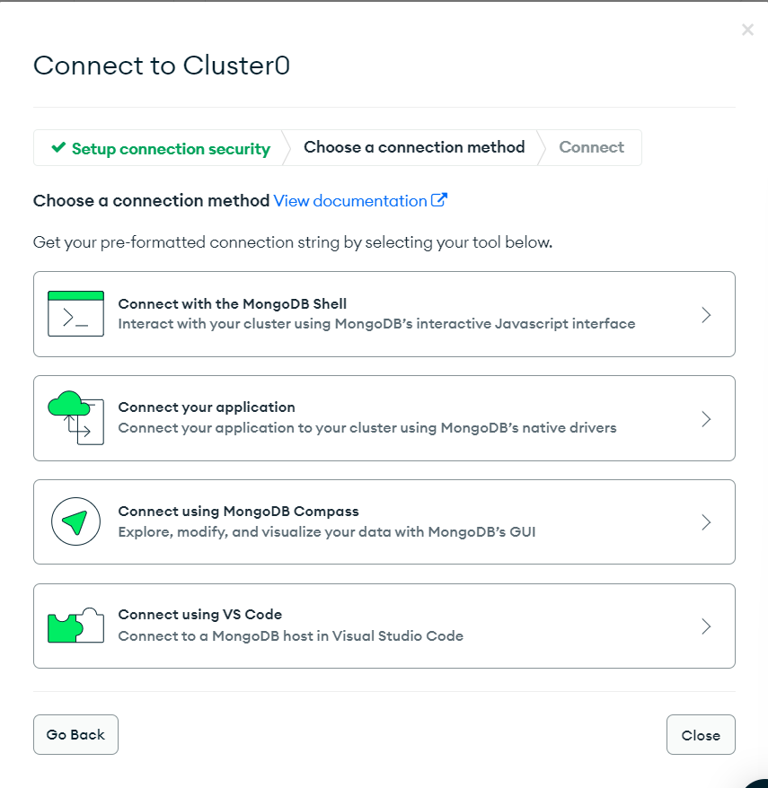
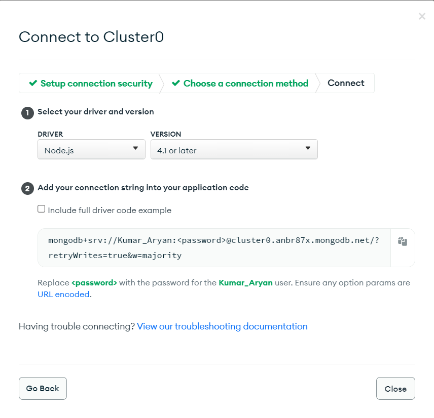
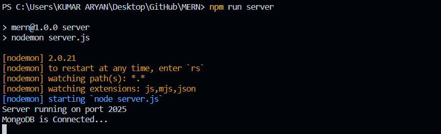

# 30 Days MERN Challenge


### <i style="color:teal">Set Up a development environment with Node.js, MongoDB and React</i>

Install Node.js: 
- Download and install Node.js from the official website: https://nodejs.org/en/download

Verify Node.js installation: 
- Open a terminal and run the following commands to verify that Node.js and npm (Node Package Manager, which comes with Node.js) are installed correctly:

```cmd
    node -v
    npm -v
```

Install MongoDB: 
- Download and install MongoDB from the official website: https://www.mongodb.com/try/download/community

- [ MongoDB Community Server Download ]

Verify MongoDB installation: 
- Open a terminal and run the following command to verify that MongoDB is installed correctly:
```cmd
    mongo --version
```

Start MongoDB: 
- Depending on your operating system, the command to start MongoDB may vary. On Unix systems, the command is typically:
```cmd
    mongod
```

Install a MongoDB driver: 
- In your Node.js project, you'll need a MongoDB driver to interact with the database. The official driver is mongodb. Install it with npm:

```cmd
    npm install mongodb
```

1. <i style="color:yellow">Create a basic Express server in Node.js</i>

- Create a new directory for your project:

```cmd
    mkdir myproject
    cd myproject
```
  
- Initialize a new Node.js project:
```cmd
    npm init -y
```
- Install Express:

```cmd
    npm install express
```
- Create a new file ' server.js ' and set up a basic Express server:

```js
    const express = require('express');
    const app = express();
    const port = 3000;

    app.get('/', (req, res) => {
        res.send('Hello World!');
    });

    app.listen(port, () => {
        console.log(`Server running at http://localhost:${port}`);
    });
```

- Run the Express server:
```cmd
    node server.js
```

- Now, you have a basic Express server running at http://localhost:3000 

---
2. <i style="color:yellow">Create a basic React application in Node.js</i>

- Create a new React application: First, you need to install create-react-app if you haven't already:

 ```cmd
    npx create-react-app client
```
- Start the React application:
Now, a React application running at http://localhost:3000.

_Please note that in a real-world application, you would probably want to serve the React application from the Express server and use a proxy to avoid CORS issues. This is a simplified example for demonstration purposes._


3. <i style="color:yellow">Connect the React Frontend to Express Backend</i>

- **Set up a proxy:** 
- In your React application's ' package.json ' file, add a proxy field pointing to the Express server's address. 
    - This will forward requests from the React app to the Express server, avoiding CORS issues.
```code
    "proxy": "http://localhost:3000"
```
- **Make a request from the React app to the Express server:** 
- In your React application, you can " use the fetch function to make a request to the Express server ". 
- _Since you set up a proxy, you can use relative URLs_.

```js
    fetch('/api')
    .then(response => response.json())
    .then(data => console.log(data));
```

- **Handle the request in the Express server:** 
- In your Express server, you need to handle the /api route and send a response. Here's a simple example:

```js
    app.get('/api', (req, res) => {
    res.json({ message: 'Hello from server!' });
});
```
- **Install and use CORS in Express server:** 
- Although the proxy helps in development, in production, you might need to handle CORS issues. Install and use the cors middleware in your Express server.

```cmd
    npm install cors
```
Then, in your server.js file:

```js
    const cors = require('cors');
    app.use(cors());
```

_Run both servers: You can now run both the Express server and the React application. They will communicate with each other through the proxy you set up._

```cmd
    # In the Express server directory
    node server.js

    # In the React application directory
    npm start
```
_Now, when you load your React application, it will make a request to the Express server and log the response to the console._


4. <i style="color:yellow">Connect the Express Backend to  MongoDB Database</i>


Start MongoDB: 
- Depending on your operating system, the command to start MongoDB may vary. On Unix systems, the command is typically:
```cmd
    mongod
```

Install a MongoDB driver: 
- In your Node.js project, you'll need a MongoDB driver to interact with the database. The official driver is mongodb. Install it with npm:

```cmd
    npm install mongodb
```

Connect to MongoDB: 
- In your Node.js code, you can now connect to MongoDB using the mongodb package. Here's a basic example:

```js
    const MongoClient = require('mongodb').MongoClient;
    const url = 'mongodb://localhost:27017/mydb';

    MongoClient.connect(url, function(err, db) {
        if (err) throw err;
        console.log("Database created!");
        db.close();
});
```
_This will connect to MongoDB running on localhost, create a new database called mydb, and then close the connection._

_Now, you have a development environment set up with Node.js and MongoDB. You can start building your application!_

Connect to MongoDB Atlas: 

- If you want to use MongoDB Atlas, you can follow the instructions below.

- Create an account <a href="https://www.mongodb.com/atlas/database"> here</a>. After creating an account, you will see something like this:



- Click the <b>Project 0</b> section (top left),
- you will see a button for Creating a New Project. 
- Create a project and select the project. 
- Now, click the <b>Build a Database</b> button from the project you have created. It will show you all the information.

- At the bottom, you will see a section called <b>Cluster Name</b>, click that and enter a name for the database, then hit the <b>Create Cluster</b> button. 
- After two to three minutes, if everything goes well, you will find something like this:



- Click the CONNECT button if you filled the username and password for your database at time of creation it will show you like this:



- Now, if you follow the CONNECT button or the Choose a connection method button, you will see some different methods. Select accordingly:



- In this case, select the Connect Your Application section.
- Now, you will get your database link, which we will use in our next step:



### Adding the database to our project

Our database is ready, and we need to add it to our project.
- Inside the project folder, create another folder named <b>config</b> and create two files named <b>default.json</b> and <b>db.js</b>.

Add the following code:

**default.json**
```json
{
  "mongoURI":
    "mongodb+srv://mern123:<password>@mernatoz-9kdpd.mongodb.net/test?retryWrites=true&w=majority"
}
 /* Replace <password> with your database password */
 ```
**db.js**

 ```js
 

const mongoose = require('mongoose');
const config = require('config');
const db = config.get('mongoURI');

const connectDB = async () => {
  try {
    mongoose.set('strictQuery', true);
    await mongoose.connect(db, {
      useNewUrlParser: true,
    });

    console.log('MongoDB is Connected...');
  } catch (err) {
    console.error(err.message);
    process.exit(1);
  }
};

module.exports = connectDB;
```

- We need a little change in our server.js file to connect to the database. Update your server.js by adding this:

```js
const connectDB = require('./config/db');

// Connect Database
connectDB();
</code>

Now, you can run the project using the 
>$ npm run server

You should see the following:


```